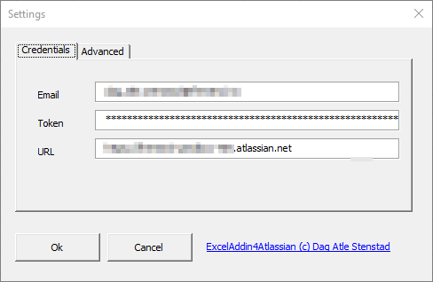
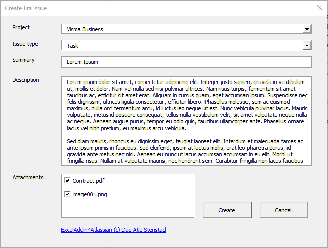
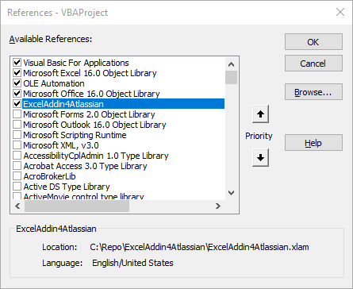

# ExcelAddin4Atlassian

ExcelAddin4Atlassian is an open-source Excel Add-in that enables you to connect your Jira and Confluence data directly to Microsoft Excel. 
It is written in Visual Basic for Application (VBA) within Excel and saved as an Add-in, allowing you to utilize its functionality across all your Excel sheets.

## Installation
1. Downaload the latest [version of ExcelAddin4Atlassian](https://github.com/Dagiz007/ExcelAddin4Atlassian/archive/master.zip).
2. Unzip the file. 
3. Add ExcelAddin4Atlassian as a new Add-in in Excel (Click the File tab, click Options, and then click the Add-Ins category. In the Manage box, click Excel Add-ins, and then click Go).
4. Start Excel og write this formula in a optional cell: **=OpenExcelAddin4AtlassianSettings()**
5. Fill in your Atlassian URL, username and token. Click <Ok> to save the change. 

##  Use/ formulas
Excel will provide suggestions as you write a formula. In the suggestion list, navigate with the arrow keys, press <Tab> to auto-complete, and <Tab> again to select. 
To view required or optional arguments for the selected function, press Ctrl + Shift + A.

**=OpenExcelAddin4AtlassianSettings()** Opens the Add-in Settings window where you can set:
* URL (URL to your instance)
* Email 
* [Token](https://id.atlassian.com/manage-profile/security/api-tokens)
* Enable logging (log all the rest API response)
* Log-path 



**=JiraCreateIssue(project, issueType, summary, description)** Creates a new Jira issue.  
Example: =JiraCreateIssue("RISK"; "Task"; "My first issue"; "Created by ExcelAddin4Atlassian")

**=JiraDownloadIssuesAttachments(jql, path)** Downloads all Jira attachments based on a JQL search string to a defined folder.

**=JiraGetIssue(key)** Retrieves Jira issues based on the selected key.
Example: =JiraGetIssue("TSU-789")

**=JiraGetIssueDaysInTransitions(key; statuses)** Returns the number of days the issue has been in one or more statuses.
Example: =JiraGetIssueDaysInTransitions("TE-1"; "Development, Testing")

**=JiraGetIssues(jql)** Gets all Jira issues based on a JQL search string.

**=JiraOpenCreateIssueForm()** Opens a form to create a new Jira issue.

##  Use ExcelAddin4Atlassian in Outlook

If you have an Outlook version that supports VBA, you can use ExcelAddin4Atlassian functionality in Outlook.

1. Open the VBA editor in Outlook and import all the source code files, **except for the following files** (otherwise, it will not compile):
* clsAppEvents.cls
* clsBreakDownTable.cls
* CoreExcel.bas
2. Then, add "Microsoft Scripting Runtime" and "Microsoft XML, v3.0" to the References list (Tools->References...). 
3. Compile the project by selecting "Compile" under the Debug menu.
4. You can now create a [shortcut on the Quick Access Toolbar](https://support.microsoft.com/en-au/office/assign-a-macro-to-a-button-728c83ec-61d0-40bd-b6ba-927f84eb5d2c) for the macro "OpenCreateJiraIssueForm."

Once this is done, you can select an email, click on the shortcut, and the solution will create a Jira issue based on the selected email.



## Use ExcelAddin4Atlassian code library in your code

If you possess your own Excel Macro-Enabled Workbook (*.xlsm), you can include ExcelAddin4Atlassian in your VBA Reference list to access the ExcelAddin4Atlassian code library.



### Getting started 

```VBA
    Dim issues As Collection
    Dim issue As clsJiraIssue
    
    Set issues = Jira.GetIssues("project=TSU AND issueType=Task")
    
    For Each issue In issues
        DoEvents
        
        Debug.Print issue.Summary
    Next

    Set issues = Nothing
    Set issue = Nothing
```

```VBA
Dim jiraKey As String
jiraKey = Jira.CreateIssue(project, issueType, summary, description)
```

The example below goes through all Confluence pages and replaces one string with another.

```VBA
    Dim fromText As String
    Dim toText As String
    
    fromText = "https://old_url.com/"
    toText = "https://new_url.com/"
    
    Dim pages As Collection
    Dim page As clsConfluencePage
    
    Set pages = confluence.getPages
    
    For Each page In pages
        DoEvents
        
        If InStr(1, page.body, fromText) > 0 Then
            page.body = Replace(page.body, fromText, toText)
            
            Call confluence.updateConfluenceContent(page.ID, page.Status, page.Title, page.body, page.Version + 1)
        End If
    Next
    
    Set pages = Nothing
    Set page = Nothing
```